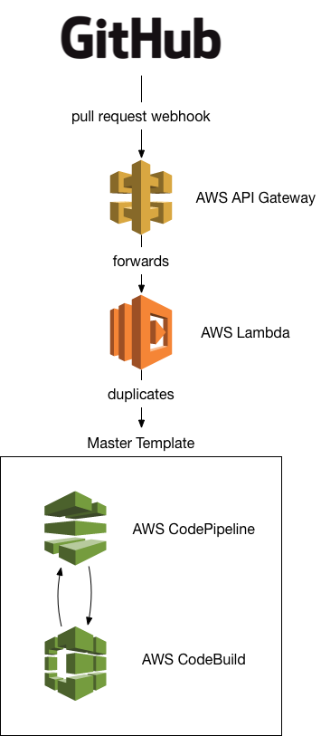

# awesome-codepipeline

After several talks [at work](http://costadigital.io/) about the feasibility of using [AWS Codebuild](https://aws.amazon.com/codebuild/) and [AWS Codepipeline](https://aws.amazon.com/codepipeline/) to verify the integrity of our codebase, I decided to give it a try. 

We use pull-requests and branching extensively, so one requirement is that we can dynamically pickup branches other than the master branch. 
AWS Codepipeline only works on a single branch out of the box, so I decided to use [Githubs webhooks](https://developer.github.com/webhooks/), [AWS APIGateway](https://aws.amazon.com/api-gateway/) and [AWS Lambda](https://aws.amazon.com/lambda/) to dynamically support multiple branches:

## Architecture

First, you create a master AWS CodePipeline, which will serve as a template for all non-master branches.  
Next, you setup an AWS APIGateway & an AWS Lambda function which can create and delete AWS CodePipelines based off of the master pipeline.  
Lastly, you wire github webhooks to the AWS APIGateway, so that opening a pull request duplicates the master AWS CodePipeline, and closing the pull request deletes it again.

## Details

### AWS Lambda

For the AWS Lambda function I decided to use [golang](https://golang.org/) & [eawsy](https://github.com/eawsy/aws-lambda-go-shim), as the combination allows for extremely easy lambda function deployments.  
The implementation relies on the AWS go sdk to manage the CodePipeline. 

### AWS APIGateway

The APIGateway is managed via terraform, and it consists of a single API, where the root resource is wired up to handle webhooks. Github specific headers are transformed so they are accessible in the backend.

### AWS CodePipeline

The CodePipeline serving as template is configured to run on master. This way all merged pull requests trigger tests on this pipeline, and every pull request itself runs on a separate AWS CodePipeline.  
This is great because every PR can be checked in parallel.

### AWS CodeBuild 

In my example the AWS CodeBuild configuration is static. However one could easily make this dynamic, e.g. by placing AWS CodeBuild configuration files inside the repository. This way the PRs could actually test different build configurations.

## Outcome

The approach outlined above works very well. It is reasonable fast and technically brings 100% utilization with it. And it brings great extensibility options to the table: one could easily use this approach to spin up entire per PR environments, and tear them down dynamically.  
In the future I'm looking forward to working more with this approach, and maybe also abstracting it further for increased reusability.
